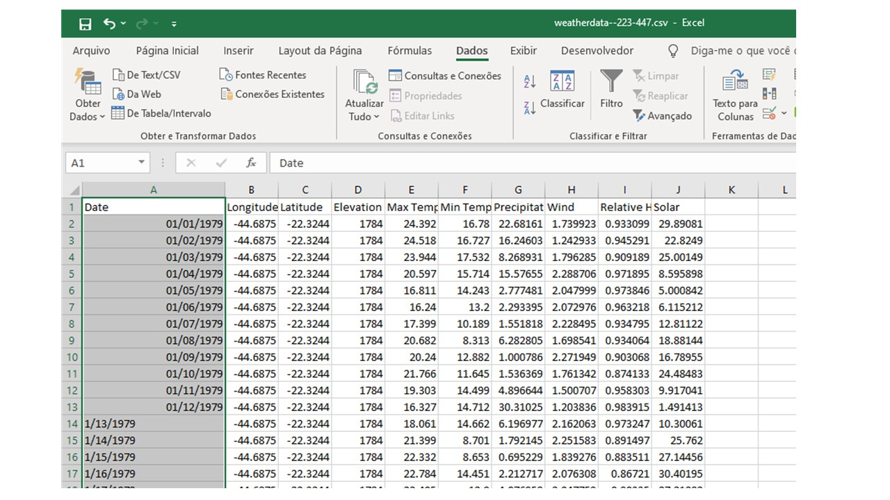

# **SWAT: Tratamento e algumas aplicações da base de dados.**

**Luis Miguel da Costa**

*(Costa, L.M., 2021. SWAT: Tratamento e algumas aplicações da base de dados.)*

---

# **1) Introdução**

Este é um exemplo de como tratar e fazer algumas estatísticas basicas com os dados do *[swat](https://swat.tamu.edu/data/)*.


## &nbsp;&nbsp;&nbsp;  **Sobre os dados**

Os dados do swat vêm com a coluna de datas com problemas, como pode se ver na figura, por isso nosso primeiro trabalho será arrumar este problema!

```{r echo=FALSE, fig.cap="",fig.align='center',out.width = "600px"}



```


Para isso iremos utilizar a função `correction_fun` que está na pasta **R**.

```{r}
source("r/correction_fun.R")
```

# **2) Criando os arquivos corrigidos**

Primeiro iremos criar os arquivos corrigidos, eles serão salvos na pasta *data*.


```{r, echo=TRUE,results="hide", warning=FALSE,cache=FALSE,message=FALSE}

lista <- list.files("data-raw/", pattern = "weather")
correction(lista)
```

Agora que eles estão criados, iremos testar e ver como nossos dados estão.

```{r, echo=TRUE, warning=FALSE,cache=FALSE,message=FALSE}

file_name <- list.files("data/",pattern = ".csv")
tabela_exemplo <- readr::read_csv(paste0("data/",file_name[1]))
head(tabela_exemplo)
```

## &nbsp;&nbsp;&nbsp; **BASE GERAL**

Agora vamos criar uma base geral para todas as estações! Valor utilizar a funçao `geral_data` para criar essa base.

```{r,echo=TRUE, warning=FALSE,cache=FALSE,message=FALSE}
# chamando função
source("r/geral_data_fun.R")

# criando a base

db <- purrr::map_df(file_name,geral_data)

write.csv(db, "data-raw/database.csv")

```


# **3) Estatísticas Descritiva**

Nossas estatiticas se concentram nas descritivas, portanto as tabelas criadas a a partir desse *script* serão: Media (mean), Desvio padrão (sd), Minimo (min), Máximo (max), Mediana (med) e Moda (mod).

## &nbsp;&nbsp;&nbsp; **Estatísticas para a base geral de dados**

Iremos fazer as climaticas em dias julianos e em meses, com as `geral_fun`, os arquivos gerais estarão salvos em *data/geral*.

```{r,echo=TRUE, warning=FALSE,cache=FALSE,message=FALSE}
## utilizar as funções criadas 
source("r/geral_julian_fun.R")
source("r/geral_month_fun.R")
## chamando os dados gerais

basegeral <- list.files("data-raw/", pattern = "database")

## criando as tabelas climaticas gerais 

geral_julian(basegeral)
geral_month(basegeral)

```


## &nbsp;&nbsp;&nbsp;**Estatísticas para a cada estação**

Agora iremos fazer as climaticas em dias julianos e em meses para cada estação, com as `ind_fun`, o objeto com os arquivos já está criado (`file_name`).

Os arquivos mensais para estação indivudual serão salvos em *data/individual/month*, já os arquivos para a climática em dias julianos estarão salvos em *data/individual/julian*.


```{r,echo=TRUE, warning=FALSE,cache=FALSE,message=FALSE}
# chamando funções

source("r/ind_julian_fun.R")
source("r/ind_month_fun.R")

# criando as climaticas para cada estação 

ind_julian(file_name)
ind_month(file_name)

```

## **Visualização**

```{r,echo=TRUE, warning=FALSE,cache=FALSE,message=FALSE}
julianbase <- readr::read_csv("data/geral/julianclimat.csv")

julianbase |> 
  ggplot2::ggplot(ggplot2::aes(x=JDAY, y=P_mean))+
  ggplot2::geom_line()+
  ggplot2::geom_point()+
  ggplot2::xlab("Julian Days")+
  ggplot2::ylab("Daily mean of Precipitation (mm)")+
  ggplot2::theme_classic()
```

```{r,echo=TRUE, warning=FALSE,cache=FALSE,message=FALSE}
list_esta <- list.files("data/individual/julian/", pattern = "csv")
tab <- readr::read_csv(paste0("data/individual/julian/",list_esta[1]))

tab |> 
  ggplot2::ggplot(ggplot2::aes(x=JDAY, y=P_mean))+
  ggplot2::geom_line()+
  ggplot2::geom_point()+
  ggplot2::xlab("Julian Days")+
  ggplot2::ylab("Daily mean of Precipitation (mm)")+
  ggplot2::theme_classic()
```


---


# **AGORA É SÓ CONTINUAR SEU PROJETO**
