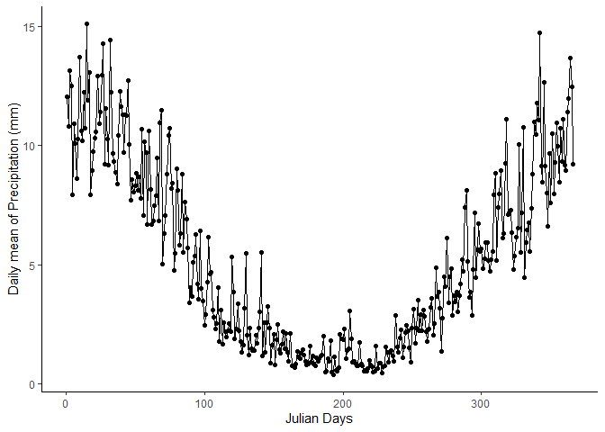
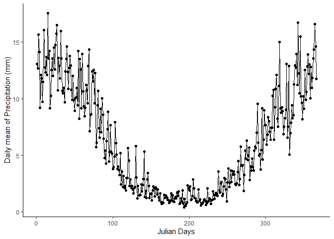

# **SWAT: Tratamento e algumas aplicações da base de dados.**

**Luis Miguel da Costa**

*(Costa, L.M., 2021. SWAT: Tratamento e algumas aplicações da base de
dados.)*

------------------------------------------------------------------------

# **1) Introdução**

Este é um exemplo de como tratar e fazer algumas estatísticas basicas
com os dados do *[swat](https://swat.tamu.edu/data/)*.

##     **Sobre os dados**

Os dados do swat vêm com a coluna de datas com problemas, como pode se
ver na figura, por isso nosso primeiro trabalho será arrumar este
problema!


Para isso iremos utilizar a função `correction_fun` que está na pasta
**R**.

``` r
source("r/correction_fun.R")
```

# **2) Criando os arquivos corrigidos**

Primeiro iremos criar os arquivos corrigidos, eles serão salvos na pasta
*data*.

``` r
lista <- list.files("data-raw/", pattern = "weather")
correction(lista)
```

Agora que eles estão criados, iremos testar e ver como nossos dados
estão.

``` r
file_name <- list.files("data/",pattern = ".csv")
tabela_exemplo <- readr::read_csv(paste0("data/",file_name[1]))
head(tabela_exemplo)
```

    ## # A tibble: 6 x 13
    ##    ...1 dates       jday longitude latitude elevation    tm max_temperature
    ##   <dbl> <date>     <dbl>     <dbl>    <dbl>     <dbl> <dbl>           <dbl>
    ## 1     1 1979-01-01     1     -44.7    -22.3      1784  20.6            24.4
    ## 2     2 1979-01-02     2     -44.7    -22.3      1784  20.6            24.5
    ## 3     3 1979-01-03     3     -44.7    -22.3      1784  20.7            23.9
    ## 4     4 1979-01-04     4     -44.7    -22.3      1784  18.2            20.6
    ## 5     5 1979-01-05     5     -44.7    -22.3      1784  15.5            16.8
    ## 6     6 1979-01-06     6     -44.7    -22.3      1784  14.7            16.2
    ## # ... with 5 more variables: min_temperature <dbl>, precipitation <dbl>,
    ## #   rh <dbl>, solar <dbl>, wind <dbl>

##     **BASE GERAL**

Agora vamos criar uma base geral para todas as estações! Valor utilizar
a funçao `geral_data` para criar essa base.

``` r
# chamando função
source("r/geral_data_fun.R")

# criando a base

db <- purrr::map_df(file_name,geral_data)

write.csv(db, "data-raw/database.csv")
```

# **3) Estatísticas Descritiva**

Nossas estatiticas se concentram nas descritivas, portanto as tabelas
criadas a a partir desse *script* serão: Media (mean), Desvio padrão
(sd), Minimo (min), Máximo (max), Mediana (med) e Moda (mod).

##     **Estatísticas para a base geral de dados**

Iremos fazer as climaticas em dias julianos e em meses, com as
`geral_fun`, os arquivos gerais estarão salvos em *data/geral*.

``` r
## utilizar as funções criadas 
source("r/geral_julian_fun.R")
source("r/geral_month_fun.R")
## chamando os dados gerais

basegeral <- list.files("data-raw/", pattern = "database")

## criando as tabelas climaticas gerais 

geral_julian(basegeral)
geral_month(basegeral)
```

##    **Estatísticas para a cada estação**

Agora iremos fazer as climaticas em dias julianos e em meses para cada
estação, com as `ind_fun`, o objeto com os arquivos já está criado
(`file_name`).

Os arquivos mensais para estação indivudual serão salvos em
*data/individual/month*, já os arquivos para a climática em dias
julianos estarão salvos em *data/individual/julian*.

``` r
# chamando funções

source("r/ind_julian_fun.R")
source("r/ind_month_fun.R")

# criando as climaticas para cada estação 

ind_julian(file_name)
ind_month(file_name)
```

## **Visualização**

``` r
julianbase <- readr::read_csv("data/geral/julianclimat.csv")

julianbase |> 
  ggplot2::ggplot(ggplot2::aes(x=JDAY, y=P_mean))+
  ggplot2::geom_line()+
  ggplot2::geom_point()+
  ggplot2::xlab("Julian Days")+
  ggplot2::ylab("Daily mean of Precipitation (mm)")+
  ggplot2::theme_classic()
```

<!-- -->

``` r
list_esta <- list.files("data/individual/julian/", pattern = "csv")
tab <- readr::read_csv(paste0("data/individual/julian/",list_esta[1]))

tab |> 
  ggplot2::ggplot(ggplot2::aes(x=JDAY, y=P_mean))+
  ggplot2::geom_line()+
  ggplot2::geom_point()+
  ggplot2::xlab("Julian Days")+
  ggplot2::ylab("Daily mean of Precipitation (mm)")+
  ggplot2::theme_classic()
```

<!-- -->

------------------------------------------------------------------------

# **AGORA É SÓ CONTINUAR SEU PROJETO**
